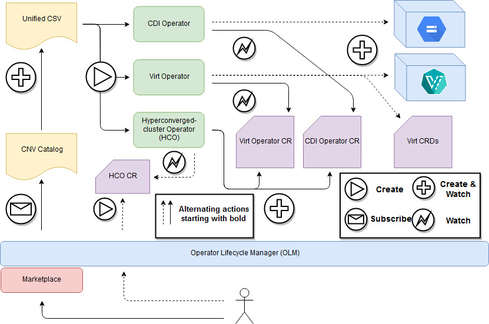
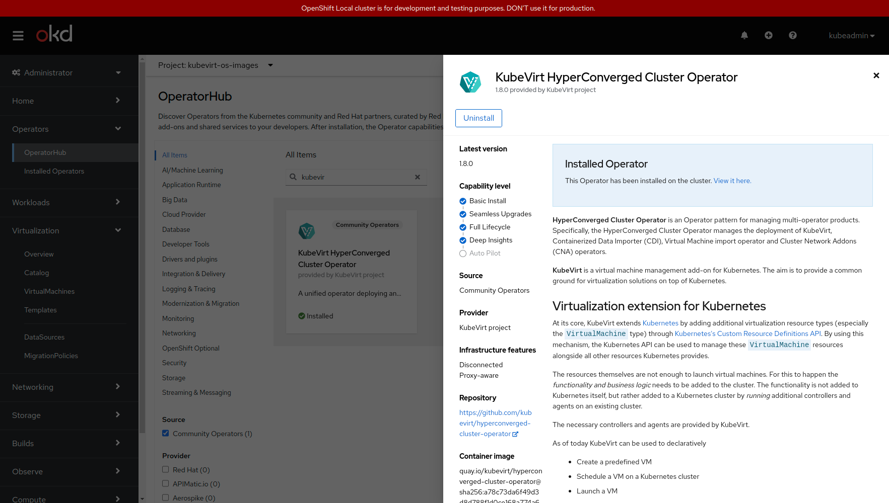

[](https://prow.ci.openshift.org/job-history/gs/origin-ci-test/logs/periodic-ci-kubevirt-hyperconverged-cluster-operator-main-hco-e2e-deploy-nightly-main-aws)
[](https://prow.ci.kubevirt.io/job-history/gs/kubevirt-prow/logs/periodic-hco-push-nightly-build-main)
[](https://goreportcard.com/report/github.com/kubevirt/hyperconverged-cluster-operator)
[](https://coveralls.io/github/kubevirt/hyperconverged-cluster-operator?branch=main)
[](https://sonarcloud.io/dashboard?id=kubevirt_hyperconverged-cluster-operator)

# Hyperconverged Cluster Operator

A unified operator deploying and controlling [KubeVirt](https://github.com/kubevirt/kubevirt) and several adjacent operators:

- [Containerized Data Importer](https://github.com/kubevirt/containerized-data-importer)
- [Scheduling, Scale and Performance](https://github.com/kubevirt/ssp-operator)
- [Tekton tasks operator](https://github.com/kubevirt/tekton-tasks-operator)
- [Cluster Network Addons](https://github.com/kubevirt/cluster-network-addons-operator)
- [Node Maintenance](https://github.com/kubevirt/node-maintenance-operator)

This operator is typically installed from the Operator Lifecycle Manager (OLM),
and creates operator CustomResources (CRs) for its underlying operators as can be seen in the diagram below.
Use it to obtain an opinionated deployment of KubeVirt and its helper operators.



In the [HCO components](docs/hco_components.md) doc you can get an up-to-date overview of the involved components.

## Installing HCO using kustomize (Openshift OLM Only)
To install the default community HyperConverged Cluster Operator, along with its underlying components, run:
```bash
$ curl -L https://api.github.com/repos/kubevirt/hyperconverged-cluster-operator/tarball/main | \
tar --strip-components=1 -xvzf - kubevirt-hyperconverged-cluster-operator-*/deploy/kustomize

$ ./deploy/kustomize/deploy_kustomize.sh
```
The deployment is completed when HCO custom resource reports its condition as `Available`.

For more explanation and advanced options for HCO deployment using kustomize, refer to [kustomize deployment documentation](deploy/kustomize/README.md).

## Installing Unreleased Bundle Using A Custom Catalog Source  

Hyperconverged Cluster Operator is publishing the latest bundle to [quay.io/kubevirt](https://quay.io/repository/kubevirt) 
before publishing tagged, stable releases to [OperatorHub.io](https://operatorhub.io).  
The latest bundle is `quay.io/kubevirt/hyperconverged-cluster-bundle:1.9.0-unstable`. It is built and pushed on every merge to
main branch, and contains the most up-to-date manifests, which are pointing to the most recent application images: `hyperconverged-cluster-operator` 
and `hyperconverged-cluster-webhook`, which are built together with the bundle from the current code at the main branch.  
The unreleased bundle can be consumed on a cluster by creating a CatalogSource pointing to the index image that contains 
that bundle: `quay.io/kubevirt/hyperconverged-cluster-index:1.9.0-unstable`.

Make the bundle available in the cluster's packagemanifest by adding the following CatalogSource:
```bash
cat <<EOF | oc apply -f -
apiVersion: operators.coreos.com/v1alpha1
kind: CatalogSource
metadata:
  name: hco-unstable-catalog-source
  namespace: openshift-marketplace
spec:
  sourceType: grpc
  image: quay.io/kubevirt/hyperconverged-cluster-index:1.9.0-unstable
  displayName: Kubevirt Hyperconverged Cluster Operator
  publisher: Kubevirt Project
EOF
```
Then, create a namespace, subscription and an OperatorGroup to deploy HCO via OLM:
```bash
cat <<EOF | oc apply -f -
apiVersion: v1
kind: Namespace
metadata:
    name: kubevirt-hyperconverged
---
apiVersion: operators.coreos.com/v1
kind: OperatorGroup
metadata:
    name: kubevirt-hyperconverged-group
    namespace: kubevirt-hyperconverged
---
apiVersion: operators.coreos.com/v1alpha1
kind: Subscription
metadata:
    name: hco-operatorhub
    namespace: kubevirt-hyperconverged
spec:
    source: hco-unstable-catalog-source
    sourceNamespace: openshift-marketplace
    name: community-kubevirt-hyperconverged
    channel: "1.9.0"
EOF
```
Then, create the HyperConverged custom resource to complete the installation.  
Further information about the HyperConverged CR and its possible configuration options can be found 
in the [Cluster Configuration](docs/cluster-configuration.md) doc.

## Deploying HCO on CRC

[CRC - Runs Containers](https://github.com/crc-org/crc) is a really convenient way to get a development/testing single node OpenShift cluster (OCP or OKD).
CRC is mainly targeted at running on developers' desktops, not for production use (it's an ephemeral cluster inside a VM).

The generic CRC requirements are:
- 4 physical CPU cores
- 9 GB of free memory
- 35 GB of storage space

but in order to have a properly sized environment to play with HCO we recommend:
- 4 physical CPU cores
- 20 GB of free memory
- 64 GB of storage space
- nested virtualization support on your laptop

You can size your CRC instance with:
```bash
$ crc config set disk-size 64
$ crc config set memory 20480
```

Monitoring can be optionally enable with:
```bash
$ crc config set enable-cluster-monitoring true
```

Starting from 4.12, CRC is already pre-configured to use kubevirt-hostpath-provisioner as a dynamic provisioner for PVs backed by CRC VM's filesystem (`crc-csi-hostpath-provisioner` is the name of this default storage class).
No other manual actions are required on the CRC VM in order to be able to store and execute nested VMs inside the CRC VM.

You can switch from OCP to OKD with:
```bash
$ crc config set preset okd
```

### Enabling nested virtualization in KVM
Nested virtualization allows you to run a virtual machine (VM) inside another VM while still using hardware acceleration from the host.
CRC runs as a VM, so in order to run Kubevirt on CRC to execute VMs with great performances you have to enable it.

#### Checking if nested virtualization is supported
For Intel processors, check the /sys/module/kvm_intel/parameters/nested file. For AMD processors, check the /sys/module/kvm_amd/parameters/nested file. If you see 1 or Y, nested virtualization is supported.

#### Enabling nested virtualization
To enable nested virtualization for Intel processors:

```bash
$ sudo modprobe -r kvm_intel
$ sudo modprobe kvm_intel nested=1
```
Nested virtualization is enabled until the host is rebooted. To enable it permanently, add `options kvm_intel nested=1` to /etc/modprobe.d/kvm.conf.

To enable nested virtualization for AMD processors:
```bash
$ sudo modprobe -r kvm_amd
$ sudo modprobe kvm_amd nested=1
```
Nested virtualization is enabled until the host is rebooted. To enable it permanently, add `options kvm_amd nested=1` to /etc/modprobe.d/kvm.conf.

### Starting CRC
Once ready you can start your CRC environment with:
```bash
$ crc setup
$ crc start
```

### Deploying HCO on CRC
KubeVirt HyperConverged Cluster Operator will be available out of the box in the Community Operators catalog in the OperatorHub page of your Openshift (OCP/OKD) cluster:


## Using the HCO without OLM or Marketplace

Run the following script to apply the HCO operator:

```bash
$ curl https://raw.githubusercontent.com/kubevirt/hyperconverged-cluster-operator/main/deploy/deploy.sh | bash
```

## Developer Workflow
If you want to make changes to the HCO, here's how you can test your changes
through [OLM](https://github.com/operator-framework/operator-lifecycle-manager/blob/master/doc/install/install.md#installing-olm).

Build the HCO container using the Makefile recipes `make container-build` and
`make container-push` with vars `IMAGE_REGISTRY`, `REGISTRY_NAMESPACE`, and `CONTAINER_TAG`
to direct it's location.

To use the HCO's container, we'll use a registry image to serve metadata to OLM.
Build and push the HCO's registry image.
```bash
# e.g. quay.io, docker.io
export IMAGE_REGISTRY=<image_registry>
export REGISTRY_NAMESPACE=<container_org>
export CONTAINER_TAG=example

# builds the registry image and pushes it to 
# $IMAGE_REGISTRY/$REGISTRY_NAMESPACE/hco-container-registry:$CONTAINER_TAG
make bundleRegistry
```

Create the namespace for the HCO.
```bash
kubectl create ns kubevirt-hyperconverged
```

Create an OperatorGroup that watches all namespaces.
```bash
cat <<EOF | kubectl create -f -
apiVersion: operators.coreos.com/v1
kind: OperatorGroup
metadata:
  name: hco-operatorgroup
  namespace: kubevirt-hyperconverged
spec: {}
EOF
```

Create a CatalogSource and a Subscription.

> If OLM Operator and Catalog Operator run in a namespace different than `openshift-marketplace`, replace `openshift-marketplace` with it in the CatalogSource and Subscription below.

```bash
cat <<EOF | kubectl create -f -
apiVersion: operators.coreos.com/v1alpha1
kind: CatalogSource
metadata:
  name: hco-catalogsource
  namespace: openshift-marketplace
spec:
  sourceType: grpc
  image: $IMAGE_REGISTRY/$REGISTRY_NAMESPACE/hco-container-registry:$CONTAINER_TAG
  displayName: KubeVirt HyperConverged
  publisher: Red Hat
EOF
```

```bash
cat <<EOF | kubectl create -f -
apiVersion: operators.coreos.com/v1alpha1
kind: Subscription
metadata:
  name: hco-subscription
  namespace: kubevirt-hyperconverged
spec:
  channel: "1.9.0"
  name: community-kubevirt-hyperconverged
  source: hco-catalogsource
  sourceNamespace: openshift-marketplace
EOF
```

Create an HCO CustomResource, which creates the KubeVirt CR, launching KubeVirt,
CDI, Network-addons, VM import, TTO and SSP.
```bash
kubectl create -f deploy/hco.cr.yaml -n kubevirt-hyperconverged
```

### Create a Cluster & Launch the HCO
1. Choose the provider
```bash
#For k8s cluster:
$ export KUBEVIRT_PROVIDER="k8s-1.17"
```
```bash
#For okd cluster:
$ export KUBEVIRT_PROVIDER="okd-4.1"
```
2. Navigate to the project's directory
```bash
$ cd <path>/hyperconverged-cluster-operator
```
3. Remove an old cluster
```bash
$ make cluster-down
```
4. Create a new cluster
```bash
$ make cluster-up
```
5. Clean previous HCO deployment and re-deploy HCO \
   (When making a change, execute only this command - no need to repeat steps 1-3)
```bash
$ make cluster-sync
```
### Command-Line Tool
Use `./cluster/kubectl.sh` as the command-line tool.

For example:
```bash
$ ./cluster/kubectl.sh get pods --all-namespaces
```

### Build and deploy HCO on top of external provider

In order to use HCO on top of external provider, i.e CRC, use:
```
export KUBEVIRT_PROVIDER=external
export IMAGE_REGISTRY=<container image repository, such as quay.io, default: quay.io>
export REGISTRY_NAMESPACE=<your org under IMAGE_REGISTRY, i.e your_name if you use quay.io/your_name, default: kubevirt>
make cluster-sync
```
`oc` binary should exists, and the cluster should be reachable via `oc` commands.
