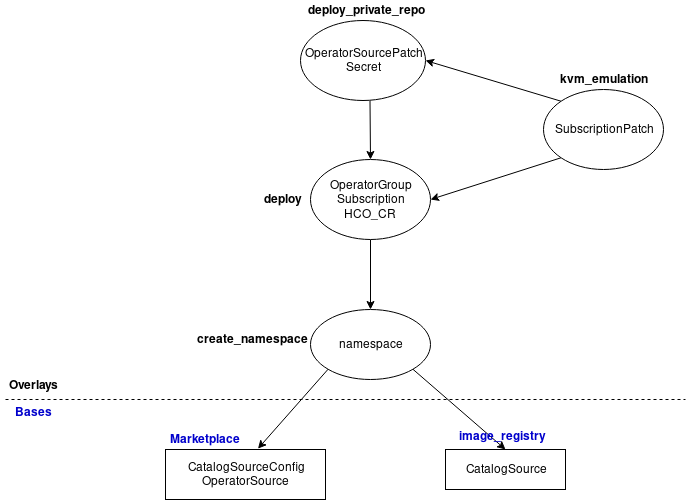

# Deployment Guidelines
The Hyperconverged Cluster Operator (HCO) can be deployed on an existing cluster using two methods. This first one is by editing and applying pre-built kustomization manifests; The second method is by generating required manifests using `deploy_kustomize.sh` consuming environment variables.

## Method 1: Deploy with a kustomization overlay
`manifests` folder contains pre-configured manifests ready to be deployed using kustomize, for various HCO deployment scenarios.
The bases are:
 1. **marketplace** - this base is used to deploy HCO operator using CatalogSourceConfig, pointing to an OperatorSource, which makes the operator available in OLM marketplace. Thus, the resources in this base are:
	 - CatalogSourceConfig
	 - OperatorSource
2. **image_registry** - this base is used to deploy HCO operator using a direct bundle image, delivered by grpc protocol. The resource this base contains is:
	- CatalogSource

Applying one of the bases alone results in HCO operator being ready for deployment manually according to [official documentation](https://github.com/kubevirt/hyperconverged-cluster-operator/blob/master/README.md).

In order to fully deploy HCO operator on your cluster, an overlay might be applied.
- First mandatory overlay is `create_namespace` which deploy the namespace to be used in the operator deployment process. Its `kustomization.yaml` has to be configured with one of the described bases above:
`create_namespace/kustomization.yaml`:
	```
	apiVersion: kustomize.config.k8s.io/v1beta1  
	kind: Kustomization  
	bases:  
	  - ../marketplace  | ../image_registry
	resources:  
	  - namespace.yaml
	 ```
- To fully deploy HCO operator onto your cluster, `deploy` overlay might be applied. It contains the following resources:
	- OperatorGroup
	- Subscription
	- HyperConverged (Custom Resource)
### Optional Overlays
- **kvm_emulation** overlay patches the Subscription resource with a configuration of an environment variable `KVM_EMULATION` set to `true`.
- **private_repo** overlay adds a secret resource (which the user must edit), and a patch to OperatorSource resource adding `spec.authorizationToken.secretName`. This overlay must be used to deploy the operator from a private quay.io repository.

### Configuration Guidelines
Current manifests are containing the default upstream configuration. In order to customize them to your requirements, some edits should be done.
 - Subscription, OperatorGroup and HyperConverged CR are defaulted to be deployed on `kubevirt-hyperconverged` namespace. For other setups, a different namespace might be used.
 - `CatalogSource` in "image_registry" deployment is defaulted with an image of `quay.io/kubevirt/hco-container-registry:latest` in `spec.image`. For a different image, this field might be changed prior to applying the manifests.
 - `Secret` in "deploy_private_repo" must be supplied with a valid token at `stringData.token`. The token could be retrieved by:
```
QUAY_USERNAME=<your quay.io username>
QUAY_PASSWORD=<your quay.io password>
curl -sH "Content-Type: application/json" -XPOST https://quay.io/cnr/api/v1/users/login -d '  
{  
 "user": { "username": "'"${QUAY_USERNAME}"'",  
 "password": "'"${QUAY_PASSWORD}"'"  
 }}' | jq -r '.token'
 ```

### Bases and overlays flowchart

 ### Summary
 - Only deliver HCO operator content to be deployed later:
 
 `oc apply -k manifests/marketplace` or `oc apply -k manifests/image_registry`
- Deliver contents only and create the namespace:

`oc apply -k manifests/create_namespace`
- Fully deploy HCO
	- default mode:
	
	`oc apply -k manifests/deploy`
	- With private repository:
	
	`oc apply -k manifests/deploy_private_repo`
	- with KVM_EMULATION env var set to true:
	
	`oc apply -k manifests/kvm_emulation`
	
	***Note:*** To use private repo with KVM_EMULATION, set `bases` property to `../deploy_private_repo` in`manifests/kvm_emulation/kustomization.yaml` file.

## Method 2: Deploy using `deploy_kustomize.sh` script
`deploy_kustomize.sh` script allows users to generate (and optionally deploy) all required customized manifests for their desired deployment configuration.
#### usage
`./deploy_kustomize.sh marketplace|image_registry [deploy]`
* First argument is whether `marketplace` or `image_registry`, which specifies the deployment strategy (see [above](#method-1-deploy-with-a-kustomization-overlay) for explanation).
* Second argument is optional and specifies whether or not the generated manifests will be applied on the cluster.

### Environment Variable Setup
Prior to running the script, some environment variables should be exported to feed the script with customized contents.
* **TARGET_NAMESPACE** - the namespace that the operator will be deployed at.
    * default: `kubevirt-hyperconverged`
* **APP_REGISTRY** - for OperatorSource and CatalogSourceConfig, to point to the HCO Operator bundle.
    * default: `kubevirt-hyperconverged`
* **CSC_SOURCE** - name of the CatalogSourceConfig, to be used in the Subscription.
    * default: `hco-catalogsource-config`
* **PACKAGE** - name of the package for OLM CatalogSourceConfig, to be available at PackageManifest.
    * default: `kubevirt-hyperconverged`
* **HCO_VERSION** - set the HCO version to be displayed in OLM
    * default: `1.0.0`
* **HCO_CHANNEL** - set the HCO channel to be subscribed to.
    * default: `1.0.0`
* **CS_SOURCE** - name of CatalogSource, to be used in subscription, in `image_registry` deployment.
    * default: `hco-catalogsource`
* **HCO_REGISTRY_IMAGE** - url of bundle image, using grpc protocol in CatalogSource, to be used in `image_registry` deployment mode.
    * default: `quay.io/kubevirt/hco-container-registry:latest` 
* **KVM_EMULATION** - whether or not create the env variable `KVM_EMULATION` in Subscription config.
    * default: `false`
* **PRIVATE_REPO** - whether or not use a private (quay) registry. If set to 'true', require a username and password to get an authentication token to use in a secret resource.
    * default: `false`
* **QUAY_USERNAME** - Username for quay.io registry, to be used in "private repo" mode.
* **QUAY_PASSWORD** - Password for the given quay.io username.
    
    _Note_: Both env vars above are required to generate the quay authentication token, to be used in a secret consumed by the OperatorSource.
* **CONTENT_ONLY** - if set to `true` do not create OperatorGroup, Subscription and HCO-CR, let the user deploy them manually using UI or CLI.
    * default: `false`
* **CREATE_NAMESPACE** - if set to `false` and `CONTENT_ONLY` is `true`, do not create the namespace as well.
    * default: `false`
    
    _Note_: if `CONTENT_ONLY` is set to `false`, the namespace will be created as other resources are referencing to it.
    

---
**_NOTE:_** During script execution, all resources are generated in a consolidated manifests file `generated_manifests.yaml`.
If `deploy` argument is specified, the script will apply these manifest to the cluster (assuming `oc` is installed and `KUBECONFIG` is configured properly), and retry until all resources are created or timeout has been exceeded.
Then, it will wait for all kubevirt pods to be spawned and HCO reports Condition=Available.
