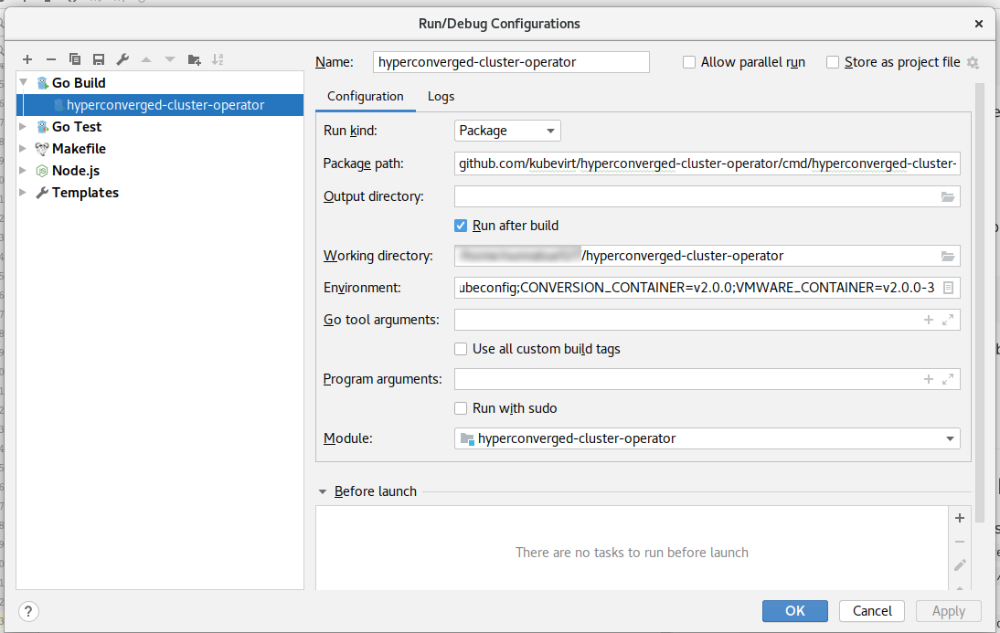
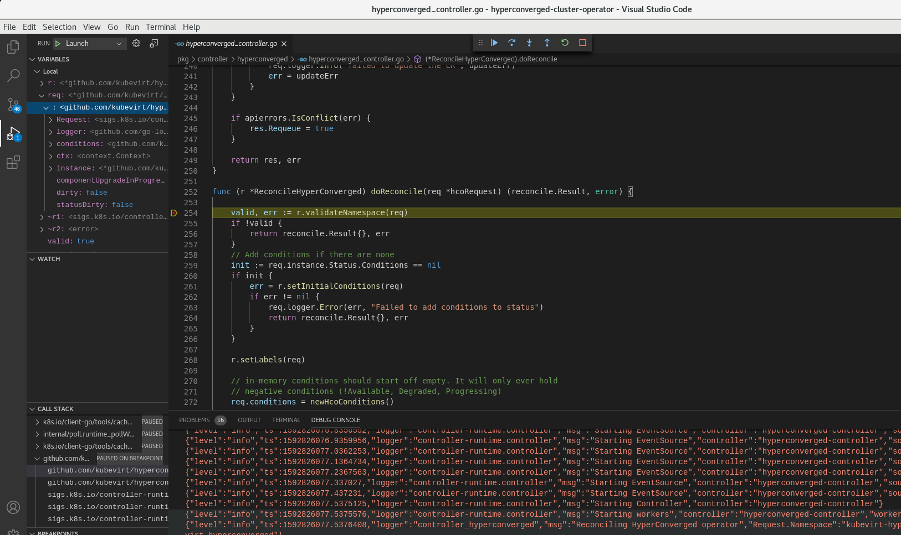

# Run HCO Locally From an IDE
***NOTE***: metrics is not supported when running locally.
## Pre-Requirements
### Kubernetes
The local HCO is going to run from an IDE, but it should communicate with a running kubernetes cluster.

In order to run, you'll need a running kubernetes, and the right configuration. Set the `KUBECONFIG` environment variable 
to the running kubernetes configurations.

Running HCO locally tested with
* [minikube](https://kubernetes.io/docs/setup/learning-environment/minikube/)
* [Code-Ready Container (CRC)](https://github.com/code-ready/crc)
* kubevirtci - for example:
  ```shell script
  $ export KUBEVIRT_PROVIDER=k8s-1.17
  $ make cluster-up
  ```
  Then, the `KUBECONFIG` environment variable should be set to `_kubevirtci/_ci-configs/k8s-1.17/.kubeconfig`.

### Local Deployments
It is required to deploy some CRDs and deployments before running the HCO itself, by running:
```shell script
$ make local
```
This will set all the CRDs and run all the KubeVirt operators except for the HCO itself, as it's going to be run from the IDE.

## Running HCO from an IDE
### Running From goland (or Intellij with golang plugin)

Add new "Go Build" run configuration.

* Set the `Run kind` to `package`.
* Set `Package path` to `github.com/kubevirt/hyperconverged-cluster-operator/cmd/hyperconverged-cluster-operator`.
* Make sure the working directory is the project's root directory.
* Set the following environment variables:

  * `WATCH_NAMESPACE=kubevirt-hyperconverged`
  * `KUBECONFIG=_kubevirtci/_ci-configs/k8s-1.17/.kubeconfig` (example)
  * `OSDK_FORCE_RUN_MODE=local`
  * `OPERATOR_NAMESPACE=kubevirt-hyperconverged`
  * `CONVERSION_CONTAINER=v2.0.0` (example)
  * `VMWARE_CONTAINER=v2.0.0-4` (example)

Now it is possible to run or debug as any golang software.

### Running from microsoft VS Code
Use the following `launch.json` file for configurations:
```json5
{
    "version": "0.2.0",
    "configurations": [
        {
            "name": "Launch",
            "type": "go",
            "request": "launch",
            "mode": "auto",
            "program": "${workspaceFolder}/cmd/hyperconverged-cluster-operator/main.go",
            "cwd": "${workspaceFolder}",
            "env": {
                "WATCH_NAMESPACE": "kubevirt-hyperconverged", 
                "KUBECONFIG": "_kubevirtci/_ci-configs/k8s-1.17/.kubeconfig",
                "OSDK_FORCE_RUN_MODE": "local",
                "OPERATOR_NAMESPACE":"kubevirt-hyperconverged",
                "CONVERSION_CONTAINER": "v2.0.0",
                "VMWARE_CONTAINER": "v2.0.0-4"
            },
            "args": []
        }
    ]
}
```
**Note**: `KUBECONFIG`, `CONVERSION_CONTAINER` and `VMWARE_CONTAINER` above are examples. Set the values that match your
environment.

Now it is possible to run HCO from VS Code.


 